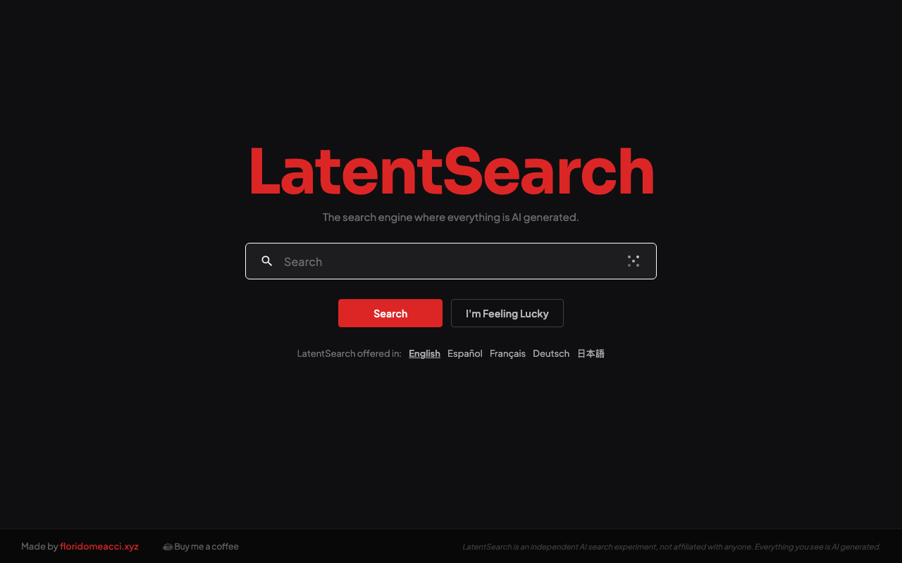

# LatentSearch

**[Visit latentsearch.net](https://latentsearch.net)**

An AI-powered search engine experiment. Generates search results, images, and page previews on the fly using large language models — no crawled index, pure inference.

Made by [floridomeacci.xyz](https://floridomeacci.xyz)


## Preview

[](https://latentsearch.net)

---

## Stack

| Layer | Tech |
|---|---|
| Frontend | Vanilla HTML / CSS / JS |
| Backend | Python 3 (`http.server`) |
| Text results | Meta Llama 4 Scout via Replicate |
| Image results | z-image-turbo via Replicate |
| Moderation | Llama Guard 3 via Replicate |
| Page preview | DeepSeek V3 via Replicate |
| Haptics | [web-haptics](https://github.com/pbakaus/web-haptics) |

---

## Setup

### 1. Clone

```sh
git clone https://github.com/floridomeacci/latentsearch.git
cd latentsearch
```

### 2. Configure API key

```sh
cp .env.example .env
# Edit .env and set your Replicate API token
```

Get a token at [replicate.com](https://replicate.com). **Never commit `.env`.**

### 3. Create Python environment

```sh
python3 -m venv .venv
source .venv/bin/activate
pip install -r requirements.txt   # no external deps needed — stdlib only
```

### 4. Run

```sh
.venv/bin/python server.py
# → http://localhost:8080
```

---

## Security

- **API key** is server-side only — never sent to the browser
- **Rate limiting** — 20 API requests per IP per 60 seconds (returns `429`)
- **Security headers** on every response: `X-Frame-Options`, `X-Content-Type-Options`, `Content-Security-Policy`, `Referrer-Policy`, `Permissions-Policy`
- **Content moderation** — every query is checked by Llama Guard before processing

### Cloudflare (recommended for production)

Proxy the server behind Cloudflare for:
- DDoS protection & bot management (enable **Bot Fight Mode**)
- WAF rules — block common attack patterns
- Rate limiting rules at the edge (supplement the in-app limiter)
- Automatic HTTPS

Recommended Cloudflare WAF rules (free tier):
1. Block known bad bots — `(cf.client.bot)` → Block
2. Challenge non-browser requests — `(not http.request.version in {"HTTP/2" "HTTP/3"})` → JS Challenge
3. Rate limit `/api/*` — 30 requests / 10 seconds per IP → Block

---

## Project Structure

```
index.html        Home page
search.html       Text results page
images.html       Image results page
server.py         Python backend (API proxy + static files)
css/style.css     All styles
js/app.js         Shared JS (autocomplete, i18n, buttons)
js/search.js      Results page JS
js/haptics.js     Haptic feedback (mobile)
.env.example      Environment variable template
```

---

## License

MIT


---

## Tech Stack

The tools and technologies used in this project:

[](https://skillicons.dev)

## Support

If you found this project useful or interesting, consider buying me a coffee!

[](https://buymeacoffee.com/floridomeacci)
